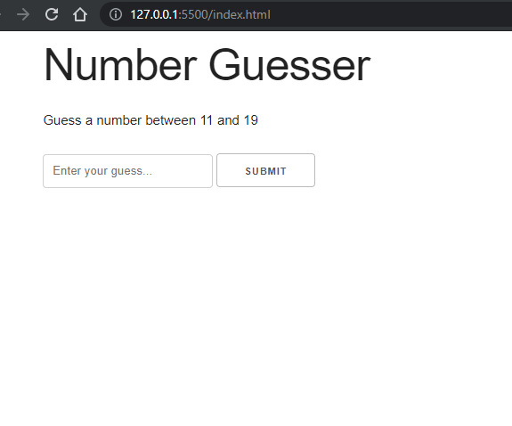
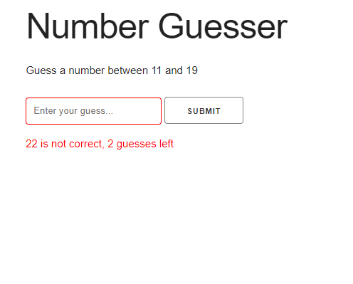
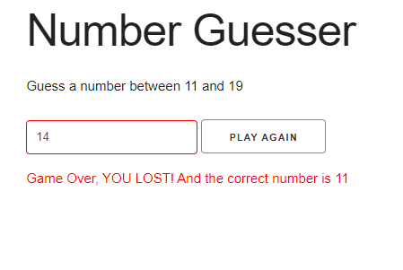
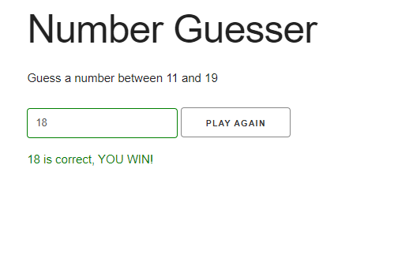

# Number-Guesser-Game

GAME FUNCTION:
- Player must guess a number between a min and max
- Player gets a certain amount of guesses
- Notify player of guesses remaining
- Notify the player of the correct answer if loose
- Let player choose to play again

